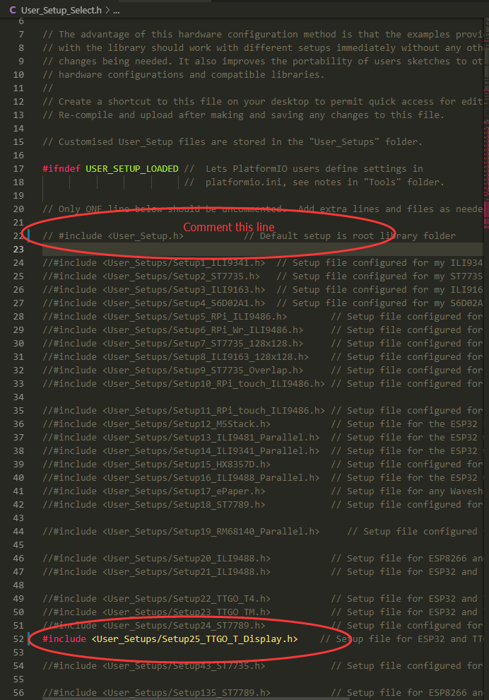

# TTGO T-Display

## 1.Install the following dependency library files:
- [TFT_eSPI](https://github.com/Bodmer/TFT_eSPI)        
- [Button2](https://github.com/LennartHennigs/Button2)

## 2.TFT_eSPI settings
- Install TFT_eSPI, in `TFT_eSPI/User_Setup_Select.h`, comment out the default settings `#include <User_Setup.h>` , select `#include <User_Setups/Setup25_TTGO_T_Display.h>` , Save Settings.

* Like the picture below

## 3.Board choose
- The board can choose `ESP32 Dev Module`, other settings can keep the default

## 4. SD card connection
- Demonstrate how to use the second SPI device, using the SD card as a demonstration device

## Pinout
| Name       | V18    |
| ---------- | ------ |
| TFT Driver | ST7789 |
| TFT_MISO   | N/A    |
| TFT_MOSI   | 19     |
| TFT_SCLK   | 18     |
| TFT_CS     | 5      |
| TFT_DC     | 16     |
| TFT_RST    | N/A    |
| TFT_BL     | 4      |
| I2C_SDA    | 21     |
| I2C_SCL    | 22     |
| ADC_IN     | 34     |
| BUTTON1    | 35     |
| BUTTON2    | 0      |
| ADC Power  | 14     |

2019/08/06:
* The TFT_eSPI and Button2 libraries have been synchronized to the main branch