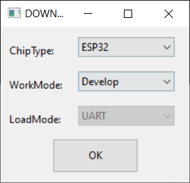
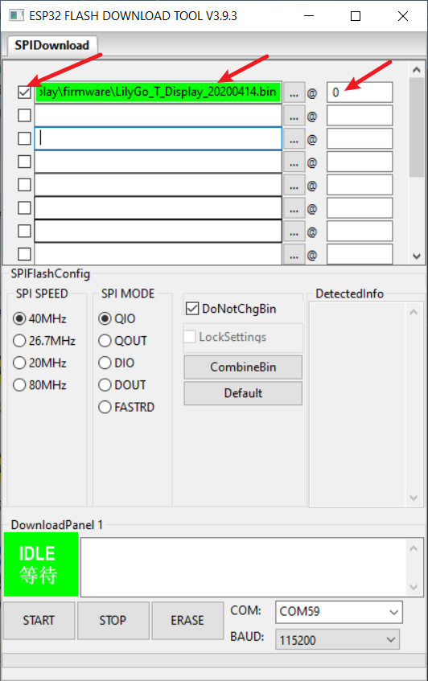

When you suspect that there is a problem with the hardware, you can brush in our test firmware

1. Download [Flash_download_tool](https://www.espressif.com.cn/sites/default/files/tools/flash_download_tool_3.9.3_0.zip)
2. Select esp32,UART
    
3. Select according to the following figure, finally select START, press RST after writing, or power on again, and then observe the log output from the serial port
    

